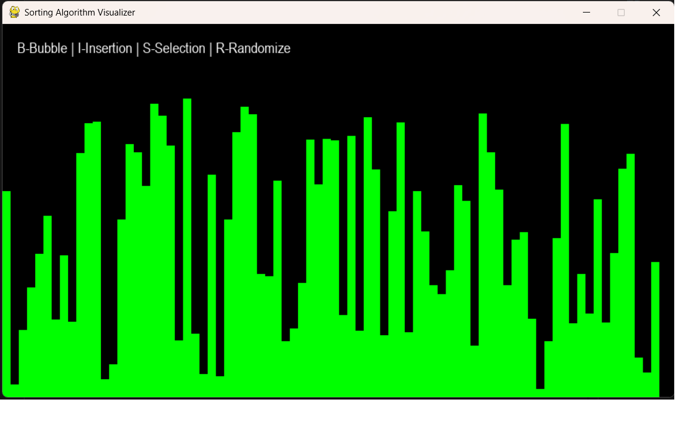
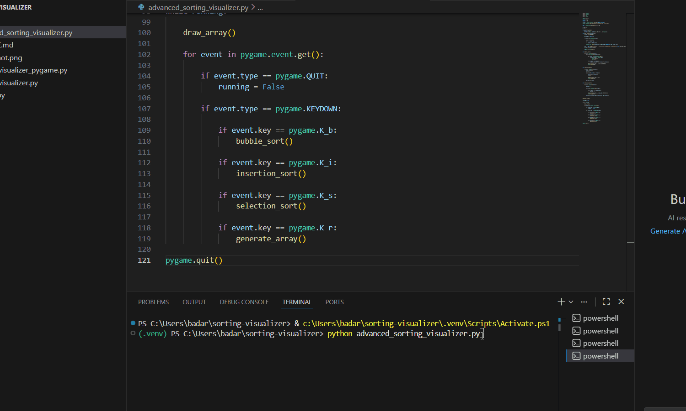

# Sorting Algorithm Visualizer

A visual tool to demonstrate how sorting algorithms work using Python.

## Features
- Visualizes sorting algorithms step by step
- Implemented using Python and Pygame
- Multiple algorithms supported

## Algorithms Included
- Bubble Sort
- Insertion Sort
- Selection Sort

## Controls
- B → Bubble Sort
- I → Insertion Sort
- S → Selection Sort
- R → Generate New Random Array

## How to Run

1. Clone the repository:
   git clone https://github.com/PhanikumarBadarala/sorting-algorithm-visualizer.git

2. Install pygame:
   pip install pygame

3. Run the program:
   python advanced_sorting_visualizer.py

## Technologies Used
- Python
- Pygame
- Data Structures and Algorithms# sorting-algorithm-visualizer
Sorting Algorithm Visualizer using Python and Pygame
## Screenshot

## Demo

